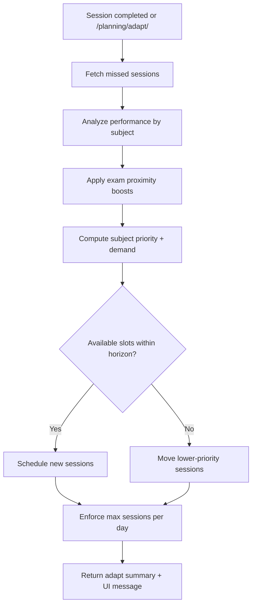

# StudySmart

StudySmart is a full-stack study planner that helps students plan sessions around exam dates, track progress, and adjust upcoming schedules based on real behavior. The system includes a Django REST API backend and a React frontend with a calendar, dashboard, and planning generator.

## Highlights

- Smart planning generation based on subject difficulty and exam proximity.
- Adaptive planning that reschedules missed sessions and boosts near-exam subjects.
- Calendar view with drag/drop and session completion controls.
- Dashboard and statistics for progress tracking.
- JWT authentication with refresh.

## Tech Stack

- Backend: Django 6 + Django REST Framework + SimpleJWT
- Frontend: React + Vite + Tailwind (utility classes used in components)
- Database: SQLite (default), compatible with PostgreSQL for production

## Project Structure

- config/: Django project configuration (settings, urls, wsgi, asgi)
- study_sessions/: Session model, API, validation, and completion logic
- planning/: Planning algorithms, adaptive planning services, stats endpoint
- subjects/: Subject model and endpoints
- notifications/: Notification model and endpoints
- users/: Auth endpoints (register, token obtain)
- frontend/: React app
  - src/pages/: Core pages (Dashboard, Calendar, Planning, Subjects, Auth)
  - src/components/: UI and layout components
  - src/services/: API wrapper and session sync utilities

## Core Concepts

### Subjects
A subject has a name, difficulty (1-5), exam date, and an owner. These attributes influence scheduling priority.

### Sessions
A session represents a study block. Sessions include:
- subject
- start_time
- duration_minutes
- status (planned, in_progress, completed)
- completed (boolean synced with status)

### Planning
Planning is the process of generating sessions across upcoming days based on subject priority and constraints.

### Adaptive Planning
Adaptive planning recalculates future sessions based on:
- Missed sessions (past sessions not completed)
- Exam proximity (higher priority when closer)
- Performance (completion rate by subject)

## Feature Breakdown

### 1) Planning Generation
The `/api/planning/generate/` endpoint builds an initial plan:
- Scores subjects by difficulty and exam urgency.
- Distributes sessions across weekdays and time slots.
- Avoids conflicts and multiple sessions per subject per day.

### 2) Missed Sessions Detection
A session is missed if:
- `start_time.date < today`
- AND `completed == false`

The adaptive planner detects missed sessions and prioritizes their subject in future scheduling.

### 3) Adaptive Rescheduling
When missed sessions exist, the system:
- Adds new sessions into upcoming days.
- Prioritizes subjects with higher missed counts.
- Enforces a max sessions per day cap (default: 3).

### 4) Exam Proximity Adjustment
If exam is near, the planner increases session frequency:
- < 5 days: stronger boost
- < 10 days: moderate boost

### 5) Performance-Based Adaptation
- High completion rate -> keep balanced (or slightly reduce extra load)
- Low completion rate or high missed count -> add extra sessions

## Backend API

Base URL: `http://localhost:8000/api`

### Authentication
- `POST /auth/register/` – Register
- `POST /auth/login/` – Get access + refresh tokens
- `POST /auth/refresh/` – Refresh access token

### Sessions
- `GET /sessions/` – List
- `POST /sessions/` – Create
- `PATCH /sessions/{id}/` – Update
- `DELETE /sessions/{id}/` – Delete
- `POST /sessions/{id}/mark_complete/` – Mark completed
- `GET /sessions/upcoming/` – Next 50 sessions
- `GET /sessions/by_subject/?subject_id=...` – Filter by subject

### Planning
- `POST /planning/generate/` – Generate initial plan
- `POST /planning/adapt/` – Run adaptive planning
- `GET /planning/stats/` – Dashboard stats
- `GET /planning/exams_timeline/` – Upcoming exams list

### Subjects
- `GET /subjects/` – List
- `POST /subjects/` – Create
- `PATCH /subjects/{id}/` – Update
- `DELETE /subjects/{id}/` – Delete

### Notifications
- `GET /notifications/` – List notifications

## Adaptive Planning Implementation (Backend)

Service entry points in `planning/services.py`:
- `getMissedSessions(user)`
- `analyzeUserPerformance(user)`
- `redistributeSessions(user, ...)`
- `adjustFuturePlanning(user, ...)`

Adaptive flow:
1) Fetch missed sessions
2) Analyze performance + exam proximity
3) Recalculate subject priority
4) Reschedule into upcoming slots with safety rules

Safety rules enforced:
- Do not modify past sessions
- Do not exceed max sessions per day
- Avoid time conflicts
- Avoid multiple same-subject sessions on one day

## Adaptive Planning Flow



## Frontend Behavior

- Calendar and dashboard pull session and subject data via the API.
- When a session is marked complete, the frontend calls `/planning/adapt/`.
- The UI displays a success message if planning was updated.

## Setup

### Backend

```bash
python -m venv venv
source venv/bin/activate
pip install -r requirements.txt
python manage.py migrate
python manage.py runserver
```

### Frontend

```bash
cd frontend
npm install
npm run dev
```

### Access

- Frontend: http://localhost:5173
- Backend: http://localhost:8000
- Admin: http://localhost:8000/admin

## Tests

```bash
python manage.py test
```

## Environment Notes

- Default database is `db.sqlite3` in project root.
- JWT tokens are stored in localStorage by the frontend.
- The API base URL is defined in `frontend/src/services/api.js`.

## Troubleshooting

- If login fails, see `DEBUG_LOGIN.md`.
- If Django is missing, ensure the venv is activated.
- If CORS issues occur, check backend CORS config in `config/settings.py`.

## Deployment Notes

- See `DEPLOYMENT_CHECKLIST.md` for production readiness.
- For production, prefer PostgreSQL and environment-based settings.

## License

Private project. No license specified.
